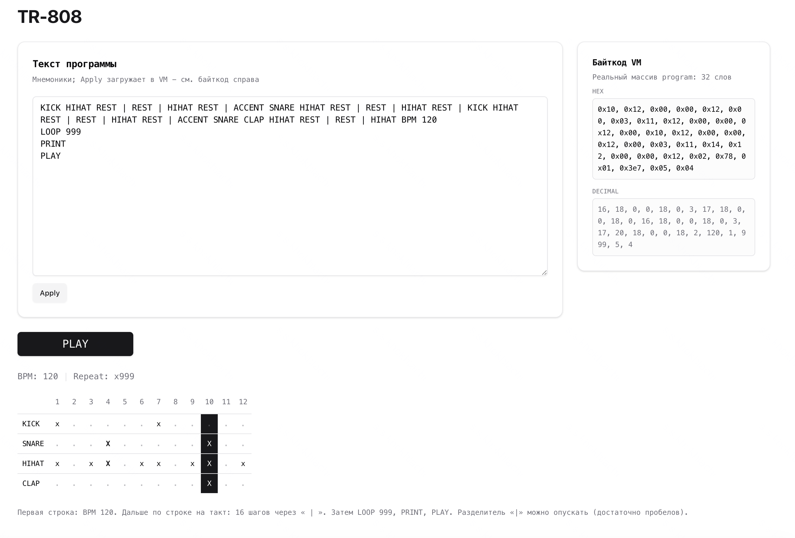

# RFC

## Контекст

Надо написать простой интерпретатор байткода и придумать кодовые обозначения для команд, например:

```
    SET A — положить число в ячейку памяти A (код 0)
    PRINT A — показать, что лежит в A (код 1)
    DEC A — уменьшить A на 1 (код 4)
    И так далее...
```

Где строчка [0, 10] означает: "выполни команду SET A (код 0) с числом 10"

Задание - написать функцию execute, которая будет "оживлять" эти цифры. Она должна:

- Ходить по программе шаг за шагом (как процессор или виртуальная машина)
- Смотреть на текущую команду (число) и понимать, что она означает
- Выполнять нужное действие (например, при виде кода 1 — печатать значение)
- Запоминать, чему сейчас равно A (это наша переменная)

## Тема: TR-808 Драм-машина

Делаем бит-машину в духе Roland TR-808 - программа из чисел задает ритмический паттерн

В коде вместо одной функции execute есть класс VM в файле bytecode-vm.ts: он идет по массиву чисел и собирает паттерн - темп, сколько раз повторять, шаги с ударами

Что делать с паттерном дальше VM не решает: при PLAY и PRINT вызывается то, что передали снаружи (Runtime) - например проиграть семплы или показать сетку

К демо прикладывается скриншот страницы с редактором программы и сеткой шагов (это обвязка поверх VM, не сама машина)



### Как устроены коды

До 0x0F - служебные команды, с 0x10 - звуки

Новый звук можно добавить, но ему нужна строка в таблице семплов, иначе машина не примет код

### Служебные команды

| Код  | Имя    | Что делает                                                                   |
| ---- | ------ | ---------------------------------------------------------------------------- |
| 0x00 | REST   | Закончить шаг и начать следующий, даже если шаг был пустой                   |
| 0x01 | LOOP   | Следующее число - сколько раз повторять паттерн при проигрывании, минимум 1  |
| 0x02 | BPM    | Следующее число - темп от 60 до 240, после сброса по умолчанию 120           |
| 0x03 | ACCENT | Первый следующий звук на этом шаге будет с акцентом, потом флаг сбрасывается |
| 0x04 | PLAY   | Отдать накопленный паттерн в runtime.play с учетом хвоста шага               |
| 0x05 | PRINT  | То же для runtime.print                                                      |

BPM и LOOP в программе занимают два слова подряд: код и аргумент

### Звуки

| Код  | Имя     |
| ---- | ------- |
| 0x10 | KICK    |
| 0x11 | SNARE   |
| 0x12 | HIHAT   |
| 0x13 | OPEN_HH |
| 0x14 | CLAP    |

Код выглядит как звук, но семпла в таблице нет - будет ошибка

### Как складываются шаги

Подряд идущие звуки попадают на один шаг

REST - явная граница: закрыли шаг, открыли новый

Если на шаге уже был KICK и снова пришел KICK, сначала закрывается текущий шаг с нотами, потом открывается новый - так можно обойтись без лишнего REST между одинаковыми ударами

ACCENT влияет на первый новый звук после себя на этом шаге, остальные звуки на том же шаге без акцента, пока снова не встретится ACCENT

PRINT и PLAY перед вызовом наружи при необходимости дописывают последний незакрытый шаг

В конце run() тоже дописывается хвост, если программа оборвалась на звуках без финального REST

### API

load - загрузить массив чисел и сбросить состояние

step - выполнить одну команду, вернется true пока есть что дальше читать

run - крутить step до конца, потом добить последний шаг

### Семплы

| Звук    | Файл               |
| ------- | ------------------ |
| KICK    | Kick Basic.wav     |
| SNARE   | Snare Mid.wav      |
| HIHAT   | Hihat.wav          |
| OPEN_HH | Open Hat Short.wav |
| CLAP    | Clap.wav           |

### Ошибки

Бросается SyntaxError, например:

- BPM out of range - темп не в диапазоне 60-240
- Loop count must be >= 1 - слишком мало повторов
- Unknown opcode 0x.. - неизвестный код

Если после BPM или LOOP нет второго числа в массиве, упадет обычная ошибка JavaScript, не эти строки

### Пример

```ts
import { INSTRUCTIONS as I } from "./bytecode-vm";

const program = [
  I.BPM,
  120,
  I.KICK,
  I.HIHAT,
  I.REST,
  I.REST,
  I.HIHAT,
  I.REST,
  I.ACCENT,
  I.SNARE,
  I.HIHAT,
  I.REST,
  I.LOOP,
  4,
  I.PRINT,
  I.PLAY,
];
```

Порядок PRINT и PLAY выбираешь сам: к моменту каждой команды в паттерне уже лежит все, что успело выполниться до нее
